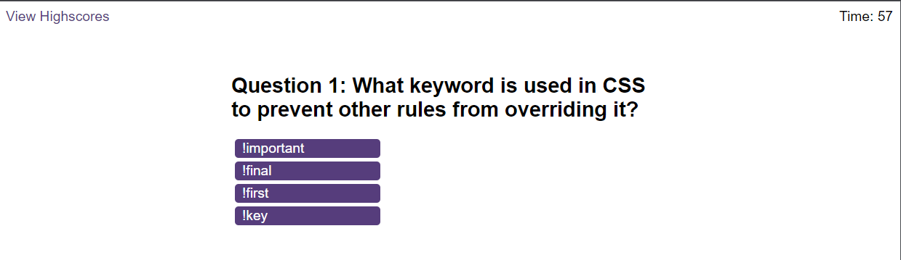
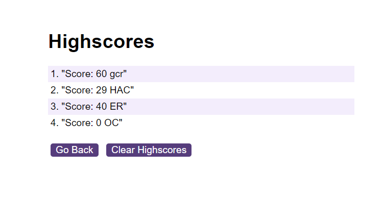

# George Ryder - Code-Quiz

## Description

A timed, multiple-choice coding quiz that can keep track of high scores and quiz-takers' initials.

My motivation behind this project was to gain a greater understanding of working with Web API's. This was something that I had not used before undertaking this project and was a struggle to wrap my head around. This is the main reason behind building this project and by creating it, I have gained a greater understanding of Web APIs and manipulating the DOM. This program solves the problem of quiz based learning alongside my own personal development in javaScript. Not only does it give people a space to test out their coding knowledge, it has given me a space to work on the more complex portions of javaScript. 
I struggled quite a bit with this project but also learnt so much whilst doing it. I feel a lot more comfortable using functions and understanding how they work, I was particularly proud of my questions function that takes in questions, options and the answer as arguments and returns these arguments as HTML elements that are appended. I think this makes the project easy to scale to add more questions. I also learnt so much about DOM manipulation and local storage. Local storage was a particular challenge for me and I had issues with storing the score and initials in an object in local storage before drawing it onto the highscore screen without it being overwritten. Luckily, I was able to fix this through a lot of trial and error and support from online services such as askBCS. As touched upon earlier, I think the scalability of my project is one thing that makes it stand out, adding new questions is easy, althogh could be further improved with a switch statement perhaps, and after that only a couple of variables would need updating in certain positions. One thing that I wanted to avoid was hard-coding any important elements, such as the questions, and, for the most part, I think I was able to achieve this.
I think there is a lot to improve with this project as I become more proficient in javaScript. Quite a lot of this project I was coding as I was learning, therefore, with greater experience in the future, I believe I will be able to condense a lot of this code down and improve the code-base. There are a few sections where I think the code is some-what bloated and this can be improved upon when revisited with greater experience. Overall, I am very proud of this project. I struggled a lot with it but was able to perservere and create a coding quiz-app that is functional whilst learning a lot of new techniques such as DOM manipulation and using local storage.

## Installation

Github repository: https://github.com/NotGeorgeHere/Code-Quiz

Live Deployment Page: https://notgeorgehere.github.io/Code-Quiz/index.html

## Usage

 

## License

N/A
